


 

&nbsp;
&nbsp;

 

**[About](#about-me)** &nbsp;·&nbsp; **[Tech Stack](#tech-stack)** &nbsp;·&nbsp; **[Multiplatform](#multiplatform-development)** &nbsp;·&nbsp; **[Experience](#professional-experience)** &nbsp;·&nbsp; **[Education](#education--certifications)** &nbsp;·&nbsp; **[Languages](#languages)** &nbsp;·&nbsp; **[Contact](#lets-connect)**

---

## About Me

<code>console.log(profile);</code>

  

I'm a **Full-Stack & Mobile Engineer** and **AI Automation Specialist** who designs and ships web, mobile, SaaS, e-commerce and automation products **end to end**: from PostgreSQL schemas and secure REST APIs to mobile-first interfaces, payment workflows and the CI/CD pipelines that deploy them.

On the front end I work with **Angular, Ionic, Next.js, React and TypeScript**. On the back end I use **Python (FastAPI, Flask)** and **Java (Spring Boot)**. **Supabase, PostgreSQL, Docker, Redis and n8n** cover data, infrastructure and automation. I have now expanded into **multiplatform development** with **Flutter, React Native, Ionic + Capacitor, .NET MAUI and native Kotlin**, so a single idea can reach Android, iOS, the web and the desktop.

I'm trilingual in **English, French and Spanish**, and I deliver remote projects for clients across **Europe and the United States**.

<table>
  <tr>
    <td width="50%" valign="top">

**🔭 Currently**

- Full-Stack Developer & AI Automation Specialist at **NORTHVIVOR**
- Building a mobile-first learning PWA at **French Voyage Akademie**
- Building SaaS and e-commerce for **Tech Services LLC** (US)

</td>
    <td width="50%" valign="top">

**🌱 Growing**

- Multiplatform: **Flutter · React Native · .NET MAUI · Kotlin**
- B.Sc. in Software Engineering at **Universidad Da Vinci** (2027)
- Learning **German** (A2)

</td>
  </tr>
</table>

<a href="#about-me">↑ back to top</a>

## Tech Stack

<code>print(stack)</code>

  

  

  

  

  

  

<a href="#about-me">↑ back to top</a>

## Multiplatform Development

<code>println("Build once, ship everywhere")</code>

Beyond the web, I build **cross-platform and native mobile apps**. Each repository below is a hands-on project in a different framework. The fundamentals are the same (state, input validation, lists, navigation, persistence and API consumption), but each one lives in its own ecosystem.

  

  <a href="https://github.com/Raul-Gamero/ActividadFlutterApp"></a>
  <a href="https://github.com/Raul-Gamero/ActividadReactNativeApp"></a>
  <a href="https://github.com/Raul-Gamero/ActividadIonicApp"></a>
  <a href="https://github.com/Raul-Gamero/ActividadMauiApp"></a>
  <a href="https://github.com/Raul-Gamero/EjerciciosKotlin"></a>

<b>🔍 Technical breakdown</b> (click to expand)

 

| Project | Stack | Targets | What it demonstrates |
|:--|:--|:--|:--|
| [**ActividadFlutterApp**](https://github.com/Raul-Gamero/ActividadFlutterApp) | Flutter 3 · Dart | Android · iOS · Web | `StatefulWidget` + `setState`, `TextEditingController`, safe parsing with `double.tryParse`, Material UI |
| [**ActividadReactNativeApp**](https://github.com/Raul-Gamero/ActividadReactNativeApp) | React Native 0.74 · Expo SDK 51 | Android · iOS · Web | Custom tab navigation, `useState` hooks, Checkbox / RadioButton / Picker inputs, product catalog with images, price and stock |
| [**ActividadIonicApp**](https://github.com/Raul-Gamero/ActividadIonicApp) | Ionic 7 · Angular 17 · Capacitor 6 | Android · iOS · Web | Standalone components, `[(ngModel)]` two-way binding, validation, `async/await` REST consumption rendered with `ion-list` |
| [**ActividadMauiApp**](https://github.com/Raul-Gamero/ActividadMauiApp) | .NET MAUI · C# · XAML · .NET 10 | Android · iOS · Windows · macOS | Single-project architecture, Shell flyout navigation, `ObservableCollection` data binding, event-driven UI |
| [**EjerciciosKotlin**](https://github.com/Raul-Gamero/EjerciciosKotlin) | Kotlin · Android SDK 34 · Gradle KTS | Android | Intents & activity lifecycle, WebView, SharedPreferences, internal/external storage, SQLite CRUD, Canvas custom views, MediaRecorder / MediaPlayer |

<a href="#about-me">↑ back to top</a>

## Professional Experience

<code>System.out.println(experience);</code>

<b>NORTHVIVOR</b> · Full-Stack Developer & AI Automation Specialist · <i>Europe · Independent · 2026 – Present</i>

 

**💻 Full-Stack Developer** 
`Next.js` `React` `TypeScript` `Tailwind CSS` `Bootstrap` `TanStack Router` `Python` `FastAPI` `Flask` `Supabase` `PostgreSQL` `REST APIs` `Webhooks` `Stripe` `Shopify` `Mirakl`

> Architected and delivered end-to-end digital products, combining high-performance frontends with scalable backend services, CRM integrations, payment workflows, tracking systems and marketplace-ready data pipelines to drive growth, automation and operational efficiency.

**🤖 AI Automation Specialist** 
`Python` `Mistral AI` `Ollama` `Llama 3` `Botpress` `n8n` `GoHighLevel` `Prompt Engineering` `AI Classification` `Data Enrichment` `CRM Automation`

> Built AI-driven automation workflows for large-scale product categorization, structured data processing and operational support, cutting manual workload and enabling faster, more scalable execution across business processes.

**📈 Growth Engineer** 
`Google Search Console` `Google Analytics` `Google Tag Manager` `Google Merchant Center` `Shopify` `Amazon Seller Central` `Amazon Ads` `Miravia` `AliExpress` `Temu` `Channable` `Decathlon` `Worten` `Mirakl`

> Engineered AI-driven workflows that categorize products at scale across **10+ marketplaces**.

<b>Tech Services LLC</b> · Full-Stack Developer · <i>United States · Freelance · 2025 – Present</i>

 

**🤖 AI Automation Specialist** 
`Angular` `TypeScript` `Tailwind CSS` `FastAPI` `Python` `Docker` `Redis` `n8n` `Railway` `REST APIs`

> Built the MVP foundation of an **AI-powered social-media automation SaaS**, including a modular dashboard, containerized services and a CI-ready setup.

**💻 Full-Stack Developer** 
`Next.js` `React` `TypeScript` `Tailwind CSS` `Python` `Flask` `Supabase` `SQL` `Stripe` `REST APIs` `Docker`

> Rebuilt a responsive **restaurant e-commerce platform** with online ordering, Stripe payments, order tracking, backend API integrations and local SEO.

<b>French Voyage Akademie</b> · Full-Stack & Mobile Developer · <i>Europe · Independent · 2022 – Present</i>

 

**📱 Mobile App Developer** · <i>2026 – Present</i> 
`Ionic` `Angular` `Java` `Spring Boot` `Hibernate/JPA` `PostgreSQL` `Docker` `Nginx` `GitHub Actions`

> Designed and built end to end a free, **production-ready progressive web app for learning French**: a secure Spring Boot/Hibernate REST API and PostgreSQL database, a mobile-first Angular/Ionic frontend, a GitHub Actions CI/CD pipeline and Dockerized infrastructure with Nginx and HTTPS.

**💻 Full-Stack Developer** · <i>2024 – Present</i> 
`Next.js` `React` `TypeScript` `Tailwind CSS` `Supabase` `Python` `Vercel`

> Migrated a French online academy from WordPress to **Next.js + Supabase**, improving SEO and adding a student management system.

**🎨 Web Designer** · <i>2023 – 2024</i> 
`WordPress` `Elementor` `Tutor LMS` `cPanel` `HTML` `CSS` `JavaScript` `PHP` `SQL`

> Developed a French learning platform with Tutor LMS, Elementor and Astra to manage courses and student learning.

**📣 Digital Marketing Specialist** · <i>2022 – 2023</i> 
`SEO` `Google Analytics` `Meta Business Suite` `Content Marketing` `Link Building`

> Managed the academy's social media on Facebook, Instagram, YouTube and TikTok, building an engaged student community.

<a href="#about-me">↑ back to top</a>

## Education & Certifications

<code>SELECT * FROM education ORDER BY year DESC;</code>

<table>
  <tr>
    <th width="50%" align="left">🎓 Academic</th>
    <th width="50%" align="left">📜 Certifications</th>
  </tr>
  <tr>
    <td valign="top">

**Bachelor's Degree in Software Engineering** 
Universidad Da Vinci · Mexico 
2024 – 2027 · in progress

**Full-Stack Developer Bootcamp** 
The Bridge · Digital Talent Accelerator · Spain 
2024 – 2025

</td>
    <td valign="top">

- **IBM** · Python Full Stack
- **IBM** · Python Back-End
- **Google** · IT Support
- **Google** · Data Analyst
- **SmartMind** · Java Development
- **PixelPro** · Full-Stack Developer

</td>
  </tr>
</table>

## Languages

  

## Let's Connect

I'm open to **remote and international projects**: full-stack products, mobile and multiplatform apps, and AI automation. Let's talk!

&nbsp;
&nbsp;

  

All graphics are self-hosted animated SVGs generated by <a href="scripts/build-assets.mjs"><code>scripts/build-assets.mjs</code></a> · Icons: <a href="https://simpleicons.org">Simple Icons</a> (CC0) &amp; <a href="https://devicon.dev">Devicon</a> (MIT)

